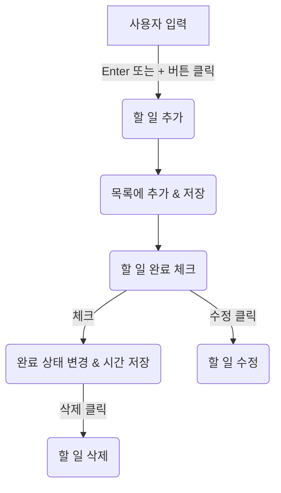

# TODO List Web App

## 프로젝트 소개

이 프로젝트는 로컬 스토리지를 활용하여 할 일을 저장하고 관리할 수 있는 간단한 TODO 리스트 웹 애플리케이션입니다. 사용자는 할 일을 추가, 완료 표시, 수정, 삭제할 수 있으며, 브라우저를 새로고침해도 데이터가 유지됩니다.

## 주요 기능

### 기존 기능

```
- 할 일 추가
- 할 일 완료 표시
- 할 일 삭제
```

### 추가 기능

```
- 할 일 수정
- 로컬 스토리지 연동 (브라우저 새로고침 후에도 데이터 유지)
- 할 일 완료 표시에 완료 시간 추가
```

## 사용 방법

1. 입력창에 할 일을 입력한 후, `+` 버튼을 클릭하거나 `Enter` 키를 눌러 추가합니다.
2. 체크 아이콘을 클릭하면 완료되며 완료 시간이 표시됩니다.
3. 할 일을 클릭하면 수정할 수 있습니다.
4. 휴지통 아이콘을 클릭하면 해당 할 일이 삭제됩니다.

## 파일 구조

```
📂 프로젝트 폴더
│── index.html # HTML 파일
│── style.css # 스타일 파일
│── main.js # JavaScript 파일
│── README.md # 프로젝트 설명 문서
```

## 플로우차트



## 기술 스택

- HTML
- CSS
- JavaScript
- LocalStorage
