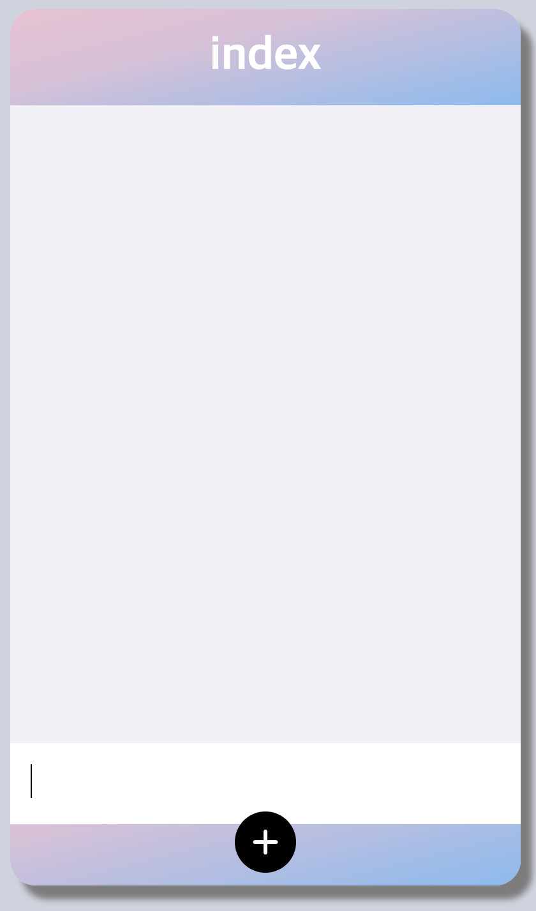
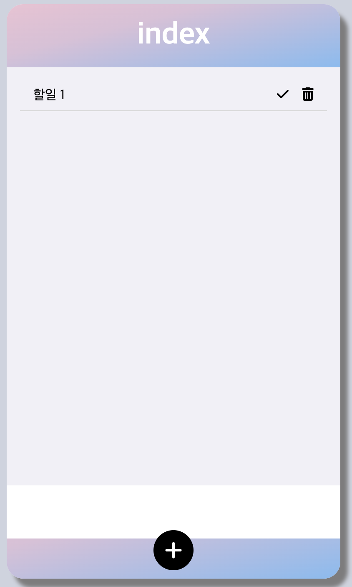
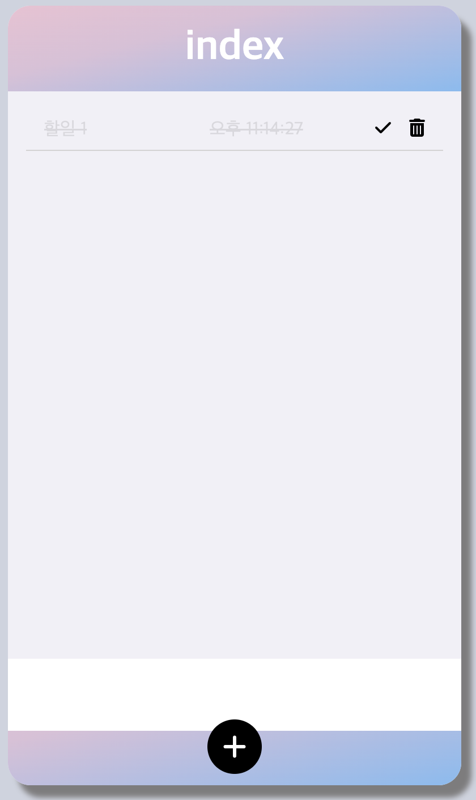
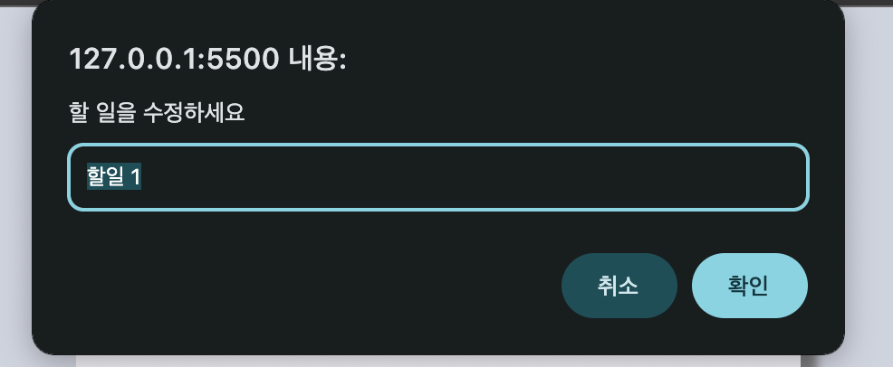

# TODO List

## 프로젝트 소개

이 프로젝트는 로컬 스토리지를 활용하여 할 일을 저장하고 관리할 수 있는 간단한 TODO 리스트 웹 애플리케이션입니다. 사용자는 할 일을 추가, 완료 표시, 수정, 삭제할 수 있으며, 브라우저를 새로고침해도 데이터가 유지됩니다.

## 주요 기능

### 기존 기능

```
- 할 일 추가
- 할 일 완료 표시
- 할 일 삭제
```

### 추가 기능

```
- 할 일 수정
- 로컬 스토리지 연동 (브라우저 새로고침 후에도 데이터 유지)
- 할 일 완료 표시에 완료 시간 추가
```

## 사용 방법

1. 입력창에 할 일을 입력한 후, `+` 버튼을 클릭하거나 `Enter` 키를 눌러 추가합니다.
2. 체크 아이콘을 클릭하면 완료되며 완료 시간이 표시됩니다.
3. 할 일을 클릭하면 수정할 수 있습니다.
4. 휴지통 아이콘을 클릭하면 해당 할 일이 삭제됩니다.

## 파일 구조

```
📂 프로젝트 폴더
│── index.html # HTML 파일
│── style.css # 스타일 파일
│── main.js # JavaScript 파일
│── README.md # 프로젝트 설명 문서
```

## 플로우차트

```mermaid
graph TD;
  A[사용자 입력] -->|Enter 또는 + 버튼 클릭| B(할 일 추가)
  B --> C(목록에 추가 & 저장)
  C --> D(할 일 완료 체크)
  D -->|체크| E(완료 상태 변경 & 시간 저장)
  D -->|수정 클릭| F(할 일 수정)
  E -->|삭제 클릭| G(할 일 삭제)
```



## 활용

{: width="300" height="450"}
{: width="300" height="450"}
{: width="300" height="450"}
{: width="600" height="300"}

## 기술 스택

- HTML
- CSS
- JavaScript
- LocalStorage
